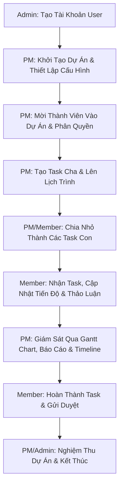
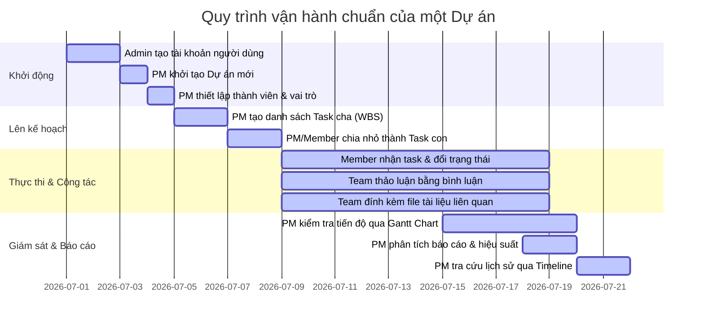

# USER GUIDE — Task Management System

Chào mừng bạn đến với **Task Management System** (Hệ thống Quản lý Công việc và Dự án). Hướng dẫn này được biên soạn chi tiết nhằm giúp người dùng ở mọi vai trò (Admin, Project Manager, Member, Guest) dễ dàng tiếp cận, làm quen và làm chủ các chức năng của hệ thống để tối ưu hóa hiệu suất làm việc nhóm.

---

## 1. Giới thiệu hệ thống

### Hệ thống dùng để làm gì?
Task Management System là nền tảng quản lý công việc và dự án trực tuyến, giúp các doanh nghiệp và đội ngũ tổ chức, lập kế hoạch, phân bổ nguồn lực, theo dõi tiến độ và đánh giá hiệu quả công việc một cách khoa học, đồng bộ và minh bạch.

### Ai là người sử dụng?
Hệ thống được thiết kế phù hợp cho nhiều đối tượng, bao gồm:
*   **Ban giám đốc / Quản trị viên hệ thống (Admin):** Theo dõi tổng quan hoạt động và cấu hình hệ thống.
*   **Quản lý dự án (Project Manager):** Lập kế hoạch, phân bổ tài nguyên và kiểm soát tiến độ.
*   **Thành viên thực hiện (Member):** Nhận nhiệm vụ, cập nhật trạng thái công việc và cộng tác.
*   **Khách hàng hoặc Đối tác (Guest):** Theo dõi tiến trình mà không làm ảnh hưởng đến dữ liệu dự án.

### Các vai trò chính trong hệ thống
1.  **Admin (Quản trị viên toàn hệ thống):** Có toàn quyền kiểm soát hệ thống, quản lý người dùng, cấu hình bảo mật và xem nhật ký hệ thống.
2.  **Project Manager - PM (Quản lý dự án):** Người chịu trách nhiệm chính của một hoặc nhiều dự án cụ thể. Có quyền quản lý thành viên, cấu hình trường thông tin động, tạo và quản lý task trong phạm vi dự án của mình.
3.  **Member (Thành viên dự án):** Nhân sự trực tiếp thực hiện công việc. Có quyền tạo task, cập nhật task được giao, thảo luận (comment) và tải tệp đính kèm.
4.  **Guest (Khách):** Người chỉ có quyền xem thông tin dự án/task được chia sẻ mà không được sửa đổi dữ liệu.

### Luồng làm việc tổng quan (Workflow)



---

## 2. Vai trò và quyền hạn người dùng

Để bảo mật thông tin và chuyên môn hóa quy trình làm việc, hệ thống áp dụng cơ chế phân quyền nghiêm ngặt theo bảng dưới đây:

| Chức năng / Quyền hạn | Admin | Project Manager (PM) | Member | Guest |
| :--- | :---: | :---: | :---: | :---: |
| **Quản lý người dùng hệ thống** (Tạo/Khóa/Xóa tài khoản) | **Có** | Không | Không | Không |
| **Xem Audit Log toàn hệ thống** | **Có** | Không | Không | Không |
| **Tạo mới và xóa mềm Dự án (Project)** | **Có** | Không | Không | Không |
| **Chỉnh sửa thông tin Dự án** | **Có** | **Có** (Chỉ dự án quản lý) | Không | Không |
| **Quản lý thành viên trong Dự án** (Thêm/Xóa/Đổi vai trò) | **Có** | **Có** (Chỉ dự án quản lý) | Không | Không |
| **Cấu hình Dynamic Fields** (Trường thông tin động) | **Có** | **Có** (Chỉ dự án quản lý) | Không | Không |
| **Tạo mới và chỉnh sửa Task** | **Có** | **Có** | **Có** | Không |
| **Đổi trạng thái Task** | **Có** | **Có** | **Có** (Task được giao/tạo) | Không |
| **Xóa mềm Task** | **Có** | **Có** | Không | Không |
| **Thêm Comment / Đính kèm File** | **Có** | **Có** | **Có** | Không |
| **Xóa Comment / File đính kèm của người khác** | **Có** | **Có** (Chỉ dự án quản lý) | Không | Không |
| **Xem Gantt Chart và Báo cáo (Report)** | **Có** | **Có** | **Có** | **Có** (Chỉ xem) |
| **Xem Activity Timeline** | **Có** | **Có** | **Có** | **Có** (Chỉ xem) |

> [!NOTE]
> * **Admin** là vai trò cấp hệ thống (System Role).
> * **Project Manager, Member, Guest** có thể là vai trò cấp dự án (Project Role). Một người dùng có thể đóng các vai trò khác nhau ở các dự án khác nhau (Ví dụ: Nguyễn Văn A là PM ở dự án A nhưng chỉ là Member ở dự án B).

---

## 3. Đăng nhập và đăng xuất

### 3.1. Hướng dẫn Đăng nhập
1.  Truy cập vào địa chỉ đường dẫn hệ thống được cung cấp (ví dụ: `https://task.company.com`).
2.  Nhập địa chỉ **Email** và **Mật khẩu** đã được quản trị viên cấp.
3.  Nhấp chọn nút **Đăng nhập** (Sign In).
4.  Nếu thông tin chính xác, bạn sẽ được chuyển hướng thẳng tới màn hình **Dashboard**.

### 3.2. Hướng dẫn Đăng xuất
1.  Nhấp vào ảnh đại diện (avatar) hoặc tên của bạn ở góc trên bên phải màn hình.
2.  Chọn **Đăng xuất** (Log Out) từ menu thả xuống.
3.  Hệ thống sẽ xóa mã định danh (Token) lưu trên trình duyệt và đưa bạn quay trở về trang đăng nhập để đảm bảo an toàn thông tin.

### 3.3. Các trường hợp xử lý sự cố thường gặp

#### Trường hợp Token hết hạn (Session Expired)
*   **Hiện tượng:** Bạn đang thao tác thì hệ thống đột ngột báo lỗi đăng nhập (thường là lỗi `Unauthorized 401`) hoặc tự động đẩy bạn ra trang đăng nhập.
*   **Nguyên nhân:** Để bảo mật, mỗi phiên đăng nhập chỉ có hiệu lực trong một khoảng thời gian nhất định (ví dụ: 24 giờ).
*   **Cách xử lý:** Đơn giản là nhập lại thông tin Email, Mật khẩu và tiến hành đăng nhập lại để nhận Token mới.

#### Trường hợp Sai email hoặc mật khẩu
*   **Hiện tượng:** Hệ thống hiển thị thông báo màu đỏ: *"Email hoặc mật khẩu không chính xác"*.
*   **Cách xử lý:** 
    *   Kiểm tra lại xem phím `Caps Lock` có đang bật hay không.
    *   Đảm bảo không copy dư khoảng trắng ở đầu/cuối Email hoặc Mật khẩu.
    *   Sử dụng chức năng "Quên mật khẩu" (nếu có) hoặc liên hệ **Admin** để reset lại mật khẩu.

#### Trường hợp Tài khoản bị vô hiệu hóa
*   **Hiện tượng:** Khi đăng nhập hệ thống báo: *"Tài khoản của bạn đã bị vô hiệu hóa. Vui lòng liên hệ Admin"*.
*   **Nguyên nhân:** Admin đã khóa tài khoản của bạn do rời dự án, vi phạm chính sách hoặc lý do bảo mật nội bộ.
*   **Cách xử lý:** Liên hệ trực tiếp với bộ phận nhân sự hoặc Admin hệ thống để yêu cầu mở khóa tài khoản.

---

## 4. Dashboard

Màn hình Dashboard là trung tâm chỉ huy cá nhân hóa, giúp bạn nắm bắt nhanh toàn bộ trạng thái công việc mà không cần truy cập từng dự án.

### Hướng dẫn chi tiết các khu vực trên Dashboard:

*   **Xem tổng quan công việc:** Phía trên cùng hiển thị các thẻ con số thống kê nhanh: Tổng số task đang mở, số task hoàn thành trong tuần, số giờ đã log (nếu có).
*   **Xem Task của tôi (My Tasks):** Danh sách hiển thị toàn bộ công việc được gán cho chính bạn. Bạn có thể nhấn vào tiêu đề task để mở cửa sổ chỉnh sửa nhanh.
*   **Xem Task quá hạn (Overdue Tasks):** Được tô màu đỏ nổi bật. Đây là những task đã qua ngày Deadline (Due Date) nhưng trạng thái vẫn chưa chuyển sang **Done** hoặc **Cancelled**. Bạn cần ưu tiên xử lý các task này ngay lập tức.
*   **Xem Task sắp đến hạn (Due Soon):** Hiển thị những công việc có deadline trong vòng 24 - 48 giờ tới, giúp bạn chủ động lên lịch làm việc hợp lý.
*   **Xem thống kê theo trạng thái:** Một biểu đồ hình tròn (Pie Chart) biểu diễn tỷ lệ phần trăm các task theo trạng thái: *Todo, In Progress, In Review, Done*. Giúp bạn đánh giá xem mình đang có bị ùn ứ ở khâu "In Review" hay không.

---

## 5. Quản lý Project

Dự án (Project) là container lớn nhất chứa các task, thành viên, tài liệu và các thiết lập riêng biệt.

### 5.1. Xem danh sách Project
*   Tại thanh menu bên trái (Sidebar), chọn **Projects** (Dự án).
*   Màn hình hiển thị danh sách toàn bộ các dự án bạn đang tham gia kèm theo các thông tin: Tên dự án, PM phụ trách, Tiến độ hoàn thành (%), và Ngày bắt đầu/kết thúc.

### 5.2. Tạo Project mới (Chỉ dành cho Admin)
1.  Truy cập menu **Projects**, nhấp nút **+ Tạo Project mới** (Create Project) ở góc phải.
2.  Điền các thông tin bắt buộc trong biểu mẫu:
    *   **Tên dự án** (Ví dụ: *Xây dựng Website bán hàng E-commerce*).
    *   **Mã dự án** (Project Code - viết tắt để làm tiền tố cho Task ID, ví dụ: *ECO*).
    *   **Mô tả ngắn** về mục tiêu dự án.
    *   **Ngày bắt đầu** và **Ngày dự kiến kết thúc**.
    *   **Project Manager:** Chọn tài khoản sẽ làm PM của dự án này.
3.  Nhấn **Lưu** (Save) để hoàn tất.

### 5.3. Sửa thông tin Project (Admin hoặc PM của Project đó)
1.  Tại danh sách dự án, chọn dự án cần sửa đổi, bấm vào biểu tượng dấu ba chấm `...` ở góc phải dòng và chọn **Cấu hình** (Settings).
2.  Cập nhật lại các thông tin như mô tả, ngày gia hạn hoặc thay đổi PM.
3.  Nhấn **Cập nhật** (Update).

### 5.4. Xóa mềm Project (Soft Delete)
*   **Định nghĩa:** Để tránh mất mát dữ liệu do lỡ tay, hệ thống áp dụng cơ chế "Xóa mềm". Dự án bị xóa mềm sẽ bị ẩn khỏi danh sách hoạt động của mọi thành viên và chuyển vào trạng thái "Lưu trữ" (Archived), nhưng dữ liệu trong cơ sở dữ liệu vẫn tồn tại và có thể khôi phục bởi Admin khi cần.
*   **Cách thực hiện:** Trong phần cấu hình dự án, kéo xuống dưới cùng chọn **Lưu trữ dự án** (Archive) hoặc **Xóa mềm** (Delete). Xác nhận mật khẩu hoặc nhập tên dự án để đồng ý xóa.

### 5.5. Các lỗi thường gặp khi không có quyền
*   **Lỗi Forbidden (403):** Khi Member cố gắng sửa thông tin dự án hoặc xóa dự án bằng cách copy-paste đường dẫn URL quản trị, hệ thống sẽ chặn lại và hiển thị cảnh báo đỏ: *"Bạn không có quyền thực hiện hành động này"*.
*   **Cách xử lý:** Nếu thực sự cần sửa đổi cấu hình dự án, hãy liên hệ PM của dự án hoặc Admin để được hỗ trợ nâng quyền.

---

## 6. Quản lý thành viên Project

PM có quyền quyết định ai sẽ tham gia vào dự án của mình và họ được làm những gì thông qua tính năng quản lý thành viên.

### 6.1. Xem danh sách thành viên dự án
Vào chi tiết một Project -> Chọn tab **Thành viên** (Members). Danh sách hiển thị tên, email, ảnh đại diện và vai trò (Role) của từng người trong dự án này.

### 6.2. Thêm thành viên vào Project
1.  Trong tab **Thành viên**, nhấn nút **+ Thêm thành viên** (Add Member).
2.  Nhập tên hoặc email của user đã có tài khoản trên hệ thống.
3.  Chọn vai trò trong dự án này: **Project Manager**, **Member**, hoặc **Guest**.
4.  Nhấn **Thêm** (Add). Thành viên mới sẽ nhận được email thông báo tham gia dự án.

### 6.3. Đổi vai trò thành viên
1.  Tìm thành viên cần thay đổi trong danh sách.
2.  Tại cột **Vai trò** (Role), click vào dropdown menu và chọn vai trò mới (Ví dụ: Từ *Member* chuyển sang *Guest*).
3.  Hệ thống lập tức áp dụng quyền hạn mới mà không cần reload trang.

### 6.4. Xóa thành viên khỏi Project
*   Nhấp vào biểu tượng dấu nhân `X` hoặc thùng rác bên cạnh dòng của thành viên cần xóa.
*   Xác nhận cửa sổ cảnh báo bật lên. Sau khi xóa, người này sẽ không còn quyền truy cập vào dự án và các task liên quan nữa. Tuy nhiên, lịch sử hoạt động cũ của họ trong dự án vẫn được giữ nguyên.

> [!IMPORTANT]
> **Ví dụ về phân quyền chéo (Cross-project Roles):**
> Hệ thống cho phép phân quyền cực kỳ linh hoạt theo từng dự án:
> *   **User Nguyễn Văn A:**
>     *   Là **Project Manager** tại dự án *A (ECO)*: Có toàn quyền tạo task, thêm người, sửa cấu hình.
>     *   Là **Member** tại dự án *B (CRM)*: Chỉ được xem dự án, nhận task được gán và cập nhật trạng thái của mình.
>     *   Là **Guest** tại dự án *C (HRM)*: Chỉ được xem tiến độ chung, không được chỉnh sửa bất kỳ thứ gì.

---

## 7. Quản lý Task

Task (Công việc) là đơn vị cốt lõi của hệ thống, nơi ghi nhận chi tiết những gì cần làm, ai làm và thời hạn hoàn thành.

### 7.1. Các thao tác cơ bản với Task

#### Xem danh sách Task
Vào dự án -> Chọn tab **Tasks**. Bạn có thể chuyển đổi giữa 2 chế độ hiển thị:
1.  **Chế độ Bảng (Kanban Board):** Trực quan hóa công việc dưới dạng các cột trạng thái (*Todo -> In Progress -> Done*). Kéo thả thẻ task để đổi trạng thái.
2.  **Chế độ Danh sách (List View):** Hiển thị dạng bảng lưới nhiều dòng, phù hợp để sắp xếp, lọc và xử lý hàng loạt.

#### Tạo Task mới
1.  Nhấp nút **+ Tạo Task** (Create Task) ở góc trên bên phải màn hình dự án.
2.  Nhập các thông tin chi tiết:
    *   **Tiêu đề:** Ngắn gọn, rõ nghĩa (Ví dụ: *Thiết kế API đăng nhập*).
    *   **Mô tả:** Chi tiết các yêu cầu, kết quả cần đạt.
    *   **Người phụ trách (Assignee):** Chọn thành viên thực hiện.
    *   **Người báo cáo (Reporter):** Mặc định là người tạo task.
    *   **Trạng thái ban đầu:** Thường là **Todo**.
    *   **Độ ưu tiên (Priority):** Chọn mức độ cấp thiết.
    *   **Ngày bắt đầu (Start Date) & Ngày đến hạn (Due Date):** Cần thiết để hiển thị trên Gantt Chart.
    *   **Parent Task (nếu có):** Chọn task cha nếu đây là task con.
3.  Nhấn **Tạo** (Create).

#### Sửa Task / Đổi Assignee / Đổi Deadline / Đổi Priority
*   Nhấp trực tiếp vào tiêu đề Task để mở Panel Chi tiết (Detail Panel) bên tay phải.
*   Nhấp trực tiếp vào các trường thông tin (như Người phụ trách, Ngày đến hạn, Độ ưu tiên) để sửa nhanh tại chỗ (Inline Edit). Hệ thống tự động lưu sau khi click ra ngoài.

#### Xóa mềm Task
*   Trong Panel Chi tiết Task, click vào dấu ba chấm `...` ở góc trên -> Chọn **Xóa Task** (Delete Task). Task sẽ biến mất khỏi bảng làm việc nhưng PM/Admin có thể khôi phục trong vòng 30 ngày từ Thùng rác dự án.

### 7.2. Tìm kiếm và Bộ lọc Task (Filters)
Hệ thống cung cấp thanh tìm kiếm nhanh ở đầu trang dự án:
*   **Search:** Gõ từ khóa không dấu hoặc có dấu để tìm kiếm theo Tiêu đề và Mô tả task.
*   **Lọc cơ bản:** Các nút bấm nhanh để lọc nhanh theo *Assignee* (Tôi/Người khác), *Status* (Đang làm/Đã xong), *Priority* (Cao/Thấp), *Due Date* (Hôm nay/Tuần này).

### 7.3. Giải thích các Trạng thái (Task Status)
*   `Todo` (Cần làm): Công việc đã lên kế hoạch nhưng chưa bắt đầu thực hiện.
*   `In Progress` (Đang làm): Công việc đang được thành viên xử lý tích cực.
*   `In Review` (Chờ duyệt): Công việc đã làm xong, đang chờ PM hoặc QC kiểm tra, phê duyệt chất lượng.
*   `Done` (Hoàn thành): Công việc đã đạt yêu cầu nghiệm thu và đóng lại.
*   `Cancelled` (Đã hủy): Công việc không còn cần thiết hoặc bị hủy bỏ vì lý do khách quan.

### 7.4. Giải thích Độ ưu tiên (Task Priority)
*   `Low` (Thấp): Công việc phụ, có thể làm lúc rảnh rỗi.
*   `Medium` (Trung bình): Công việc tiêu chuẩn, hoàn thành theo đúng tiến độ kế hoạch.
*   `High` (Cao): Công việc quan trọng, cần ưu tiên xử lý trước các task khác.
*   `Critical` (Khẩn cấp): Lỗi nghiêm trọng hoặc công việc sống còn của dự án. Cần dừng các công việc khác để tập trung giải quyết ngay lập tức.

### 7.5. Lỗi xung đột dữ liệu (Optimistic Concurrency)
Hệ thống áp dụng cơ chế khóa lạc quan (Optimistic Concurrency) để tránh việc ghi đè dữ liệu vô tình khi nhiều người cùng thao tác trên một task.

> [!WARNING]
> **Kịch bản lỗi:**
> 1. Bạn (User A) và đồng nghiệp (User B) cùng mở chi tiết Task "Sửa lỗi UI trang chủ" cùng một lúc.
> 2. User B đổi độ ưu tiên từ *Medium* thành *High* và nhấn lưu lúc **10:00:00**.
> 3. Bạn (User A) sửa mô tả task và bấm lưu lúc **10:00:05**.
> 4. **Hệ thống cảnh báo lỗi:** *"Thông tin Task đã được thay đổi bởi một người dùng khác. Vui lòng tải lại dữ liệu mới nhất trước khi lưu."*
> 
> **Cách xử lý:**
> * Bạn không được bấm F5 tải lại trang ngay lập tức vì sẽ mất nội dung mô tả bạn vừa viết.
> * Hãy copy phần mô tả bạn vừa viết ra Notepad/bộ nhớ tạm.
> * Nhấn nút **Hủy/Đóng** hoặc reload trang chi tiết Task để nhận thay đổi của User B.
> * Dán lại nội dung mô tả của bạn vào và bấm Lưu lần nữa.

---

## 8. Task cha/con (Parent / Subtasks)

Tính năng chia nhỏ công việc giúp quản lý các đầu việc phức tạp một cách khoa học theo cấu trúc cây (WBS).

### 8.1. Định nghĩa và khi nào nên dùng?
*   **Task cha (Parent Task):** Đại diện cho một hạng mục lớn hoặc một tính năng hoàn chỉnh.
*   **Task con (Subtask):** Các công việc nhỏ cụ thể, ngắn hạn để hoàn thành hạng mục lớn đó.
*   **Khi nào dùng:** Nên dùng khi một công việc cần phối hợp nhiều phòng ban (ví dụ: Task cha là "Làm video marketing" cần có các task con: "Viết kịch bản", "Quay phim", "Dựng video").

### 8.2. Các quy tắc quan trọng trong hệ thống
1.  **Cùng Dự án:** Task cha và các task con của nó bắt buộc phải thuộc cùng một dự án.
2.  **Không tự làm cha chính mình:** Task A không thể chọn chính Task A làm Parent Task.
3.  **Không tạo vòng lặp:** Nếu Task A là cha của Task B, và Task B là cha của Task C, thì Task C không thể chọn Task A làm cha của nó.
4.  **Ràng buộc khi xóa/đóng:** Hệ thống không cho phép xóa task cha hoặc chuyển trạng thái task cha sang **Done** nếu vẫn còn tồn tại các task con đang ở trạng thái chưa hoàn thành (`Todo`, `In Progress`, `In Review`).

### 8.3. Hướng dẫn thao tác
*   **Gán task con vào task cha:** Khi tạo hoặc sửa một Task, tìm trường thông tin **Parent Task** -> Gõ tìm kiếm tên của task cha mong muốn và chọn.
*   **Bỏ quan hệ cha/con:** Mở chi tiết task con -> Click vào trường **Parent Task** -> Click dấu `X` cạnh tên task cha đang chọn để xóa liên kết.
*   **Xem danh sách task con:** Mở chi tiết của Task cha -> Chọn tab **Subtasks** ở menu nội bộ. Hệ thống sẽ liệt kê toàn bộ danh sách các task con kèm trạng thái và người phụ trách tương ứng.

> [!NOTE]
> **Ví dụ thực tế:**
> *   **Task cha:** *Xây dựng màn hình Dashboard* (ECO-101)
>     *   **Task con 1:** *Thiết kế giao diện UI Dashboard trên Figma* (ECO-102) -> Giao cho Designer.
>     *   **Task con 2:** *Viết API thống kê dữ liệu Dashboard* (ECO-103) -> Giao cho Backend Developer.
>     *   **Task con 3:** *Gọi API và binding dữ liệu lên giao diện* (ECO-104) -> Giao cho Frontend Developer.
>     *   **Task con 4:** *Viết Integration Test kiểm thử Dashboard* (ECO-105) -> Giao cho QA Tester.

---

## 9. Comment trong Task

Phần bình luận (Comment) đóng vai trò như một kênh giao tiếp thời gian thực, lưu trữ toàn bộ trao đổi nghiệp vụ ngay tại thẻ công việc để dễ dàng tra cứu về sau.

### 9.1. Xem và Thêm Comment
*   Mở chi tiết Task, cuộn xuống phần **Thảo luận** (Discussion / Comments).
*   Tại ô nhập liệu, gõ nội dung trao đổi của bạn. Bạn có thể sử dụng định dạng văn bản thô hoặc Markdown để làm nổi bật văn bản.
*   Nhấn **Gửi** (Send) hoặc tổ hợp phím `Ctrl + Enter`.

### 9.2. Sửa và Xóa Comment
*   **Tự quản lý:** Bạn chỉ được phép Sửa (Edit) hoặc Xóa (Delete) những comment do chính tài khoản của bạn viết. Di chuột vào comment của mình, chọn nút **Sửa** hoặc **Xóa** xuất hiện ở góc phải comment.
*   **Quyền quản trị của PM/Admin:** PM của dự án đó hoặc Admin hệ thống có quyền xóa (Delete) comment của bất kỳ ai nếu nội dung vi phạm nội quy, không lịch sự hoặc sai lệch thông tin để giữ gìn không gian làm việc sạch sẽ. Tuy nhiên, họ không có quyền sửa nội dung comment của người khác.

### 9.3. Lưu ý về nội dung comment và bảo mật
*   Tuyệt đối không comment các thông tin bảo mật nhạy cảm như: *Mật khẩu tài khoản thử nghiệm, API Key, Token, hoặc Thông tin thẻ tín dụng của khách hàng*. Hãy sử dụng các công cụ quản lý mật khẩu chuyên dụng.
*   Comment mang tính chất công việc lịch sự, văn minh, ngắn gọn, đi thẳng vào vấn đề cần giải quyết.

---

## 10. Đính kèm File (Attachments)

### 10.1. Hướng dẫn thao tác
*   **Upload file:** Mở chi tiết Task, click vào vùng **Đính kèm File** (hoặc kéo thả tệp tin từ máy tính của bạn trực tiếp vào vùng làm việc của thẻ Task).
*   **Xem danh sách file:** Các file đã tải lên thành công sẽ hiển thị dưới dạng danh sách thu nhỏ (Thumbnail) trong mục **Tài liệu đính kèm**.
*   **Tải file:** Click vào tên file hoặc biểu tượng mũi tên tải xuống cạnh file để tải về máy tính cá nhân.
*   **Xóa file:** Click vào biểu tượng thùng rác nhỏ trên Thumbnail của file để xóa. (Người upload và PM/Admin mới có quyền xóa).

### 10.2. Các giới hạn cấu hình file bắt buộc
Để đảm bảo an toàn hệ thống và tối ưu dung lượng lưu trữ, hệ thống áp dụng các giới hạn sau:
1.  **Dung lượng tối đa:** Không quá **10 MB** cho mỗi file tải lên.
2.  **Loại file cho phép:** Hệ thống chỉ nhận các định dạng tài liệu phổ biến như `.pdf, .docx, .xlsx, .pptx, .txt, .zip, .rar` và các tệp hình ảnh `.png, .jpg, .jpeg, .gif`. 
    *   *Nghiêm cấm tải lên các file thực thi có nguy cơ chứa mã độc như `.exe, .bat, .sh, .msi`*.
3.  **Số lượng file tối đa:** Mỗi task giới hạn đính kèm tối đa **15 files**.

### 10.3. Các lỗi thường gặp khi đính kèm file
*   **Lỗi "File quá lớn":** Hệ thống báo lỗi đỏ và từ chối upload.
    *   *Cách xử lý:* Nén file lại dưới định dạng `.zip` hoặc upload lên Google Drive/OneDrive rồi comment link chia sẻ vào task.
*   **Lỗi "Định dạng file không được hỗ trợ":** Khi bạn cố gắng upload file `.exe` hoặc các định dạng lạ.
    *   *Cách xử lý:* Nén file đó thành `.zip` trước khi upload để hệ thống chấp nhận.
*   **Lỗi không tải được file:** Xảy ra do đường truyền gián đoạn hoặc bạn bị PM tước quyền truy cập dự án ngay trong lúc đang thao tác.
    *   *Cách xử lý:* F5 tải lại trang để kiểm tra quyền hạn của mình.

---

## 11. Dynamic Fields (Trường thông tin động)

Mỗi dự án có những đặc thù riêng. Tính năng Dynamic Fields cho phép PM tự tạo thêm các trường dữ liệu tùy chỉnh mà không cần lập trình viên can thiệp code.

### 11.1. Dynamic Field là gì và khi nào cần dùng?
Là trường thông tin tùy biến do PM/Admin định nghĩa thêm cho dự án.
*   *Ví dụ:* Một dự án phần mềm cần thêm trường "Môi trường lỗi" (Staging/Production); một dự án kế toán cần trường "Ngân sách phát sinh" (Budget); một dự án bán hàng cần trường "Tên khách hàng" (Client Name).

### 11.2. Các loại trường dữ liệu hỗ trợ
*   **Text (Văn bản ngắn):** Nhập chữ, số tùy ý (Ví dụ: Tên khách hàng).
*   **Number (Số):** Chỉ cho nhập số (Ví dụ: Ngân sách, Số giờ dự kiến).
*   **Date (Ngày tháng):** Chọn ngày từ lịch bật lên (Ví dụ: Ngày bàn giao thực tế).
*   **Boolean (Đúng/Sai):** Dạng checkbox tích chọn Có/Không (Ví dụ: *Is Billable* - Dự án này có tính phí khách hàng hay không).
*   **Select (Chọn một):** Menu thả xuống chọn duy nhất 1 giá trị trong danh sách định sẵn (Ví dụ: Độ rủi ro: *Thấp / Trung bình / Cao*).
*   **MultiSelect (Chọn nhiều):** Chọn nhiều giá trị cùng lúc (Ví dụ: Công nghệ sử dụng: *React, .NET Core, SQL Server*).

### 11.3. Cấu hình Dynamic Fields (Dành cho PM/Admin)
1.  Vào Dự án -> Chọn **Cấu hình** -> Chọn mục **Dynamic Fields**.
2.  Nhấn nút **+ Thêm Field mới**.
3.  Đặt tên trường (ví dụ: `Budget`), Chọn Loại dữ liệu (`Number`), thiết lập xem có bắt buộc điền (`Required`) hay không.
4.  Nhấn **Lưu cấu hình**. Kể từ lúc này, mọi Task được tạo mới hoặc chỉnh sửa trong dự án này sẽ xuất hiện thêm ô `Budget` để người dùng nhập liệu.
5.  **Tắt/Xóa field động:** Nếu không dùng nữa, PM có thể chuyển trạng thái field sang `Inactive` (Ẩn đi) hoặc nhấn `Delete` để xóa vĩnh viễn (Lưu ý: Xóa field động sẽ xóa toàn bộ dữ liệu đã nhập ở trường này trong các task cũ).

---

## 12. Filter nâng cao AND/OR (Advanced Filters)

Khi dự án lên tới hàng nghìn task, bộ lọc nâng cao AND/OR là công cụ đắc lực giúp bạn nhanh chóng tìm ra chính xác các task cần tìm.

### 12.1. Phân biệt Filter cơ bản và Filter nâng cao
*   **Filter cơ bản:** Chỉ lọc theo từng tiêu chí đơn lẻ (Ví dụ: Tất cả task của tôi).
*   **Filter nâng cao:** Kết hợp nhiều điều kiện logic toán học phức tạp bằng phép toán **VÀ (AND)** và **HOẶC (OR)** bao gồm cả các trường mặc định lẫn trường động (Dynamic Fields).

### 12.2. Ý nghĩa của phép toán AND và OR
*   `AND` (Phép VÀ): Hệ thống chỉ trả về kết quả nếu task **thỏa mãn đồng thời tất cả** các điều kiện bạn thiết lập. Điều kiện càng nhiều, kết quả trả ra càng ít và càng chính xác.
*   `OR` (Phép HOẶC): Hệ thống sẽ trả về kết quả nếu task **chỉ cần thỏa mãn ít nhất một** trong các điều kiện bạn thiết lập. Kết quả trả ra sẽ mở rộng hơn.

### 12.3. Hướng dẫn thao tác thiết lập bộ lọc
1.  Tại danh sách task của dự án, chọn nút **Bộ lọc nâng cao** (Advanced Filter).
2.  **Thêm điều kiện:** Chọn Trường thông tin (Ví dụ: *Status*) -> Chọn Toán tử (Ví dụ: *bằng / bằng một trong*) -> Chọn Giá trị (Ví dụ: *In Progress*).
3.  Nhấp chọn liên kết logic giữa các hàng điều kiện: Chọn **AND** hoặc **OR**.
4.  Bạn có thể bấm **+ Thêm điều kiện con** để lồng các nhóm điều kiện phức tạp.
5.  Nhấn **Áp dụng** (Apply) để lọc danh sách.
6.  **Xóa điều kiện:** Nhấn biểu tượng thùng rác/dấu nhân bên cạnh dòng điều kiện để xóa nó đi, hoặc nhấn **Xóa bộ lọc** (Clear Filter) để quay về mặc định.

### 12.4. Ví dụ thực tế

#### Ví dụ bộ lọc sử dụng logic AND
Tìm các task đang trực tiếp làm, quan trọng và ngân sách lớn:
*   `Trạng thái (Status)` = `In Progress`
*   **AND** `Độ ưu tiên (Priority)` = `High`
*   **AND** `Ngân sách (Budget)` (Dynamic Field) > `1.000.000 VNĐ`
*(Kết quả: Chỉ các task thỏa mãn cả 3 tiêu chí trên mới hiển thị)*.

#### Ví dụ bộ lọc sử dụng logic OR
Tìm các task cần xử lý khẩn cấp do quá hạn hoặc có tính chất cực kỳ quan trọng:
*   `Độ ưu tiên (Priority)` = `Critical`
*   **OR** `Ngày đến hạn (Due Date)` < `Hôm nay`
*(Chỉ cần task khẩn cấp HOẶC task bị quá hạn là sẽ xuất hiện trong danh sách)*.

> [!CAUTION]
> **Lưu ý khi filter không ra kết quả:**
> Lỗi phổ biến nhất là đặt các điều kiện mâu thuẫn nhau bằng toán tử AND.
> *Ví dụ:* `Status = Todo` **AND** `Status = Done`. Một task không thể vừa chưa bắt đầu vừa hoàn thành được, kết quả trả ra sẽ luôn luôn trống. Hãy đổi sang toán tử `OR` hoặc xóa bớt điều kiện mâu thuẫn.

---

## 13. Gantt Chart công việc

Gantt Chart là biểu đồ thanh ngang trực quan hóa dòng thời gian (Timeline) của dự án, giúp PM và các thành viên thấy rõ sự phụ thuộc giữa các công việc, các mốc quan trọng (Milestones) và tiến độ tổng thể.

### 13.1. Điều kiện để Task xuất hiện trên Gantt Chart
Task bắt buộc phải được thiết lập đầy đủ hai thông số:
1.  **Ngày bắt đầu** (Start Date).
2.  **Ngày đến hạn/Kết thúc** (Due Date / End Date).
*Nếu thiếu 1 trong 2 thông số này, task sẽ bị chuyển vào danh sách **"Unscheduled Tasks"** (Công việc chưa lập lịch) ở thanh trượt bên lề và không vẽ được lên biểu đồ.*

### 13.2. Hướng dẫn sử dụng giao diện Gantt Chart
*   **Truy cập:** Chọn Dự án -> Chọn tab **Gantt Chart**.
*   **Đọc biểu đồ:** 
    *   Trục dung bên trái hiển thị danh sách cây thư mục Task (Task cha nằm trên, task con thụt lề ở dưới).
    *   Trục hoành phía trên hiển thị dòng thời gian theo Ngày, Tuần, Tháng hoặc Quý.
    *   Thanh ngang biểu diễn thời lượng thực hiện task. Độ dài thanh tương ứng với số ngày thực hiện. Màu sắc thanh tương ứng với Trạng thái của Task.
*   **Kéo thả trực quan (Interactive Gantt):** PM có thể đưa chuột vào thanh ngang:
    *   *Kéo cả thanh:* Để di chuyển dịch chuyển toàn bộ khoảng thời gian thực hiện task sang ngày khác mà không đổi thời lượng làm việc.
    *   *Kéo hai đầu thanh:* Để co giãn ngày bắt đầu hoặc ngày kết thúc để tăng/giảm thời lượng làm việc.
*   **Lọc dữ liệu:** Có thể lọc Gantt nhanh theo Assignee, Status hoặc khoảng thời gian (Date Range) để xem lịch trình của riêng nhóm mình.

> [!TIP]
> **Ví dụ Lịch trình Dự án triển khai phần mềm CRM trên Gantt Chart:**
> *   **Task A (Khảo sát yêu cầu):** Kéo dài từ ngày 01/07 đến ngày 05/07 (Thanh hiển thị dài 5 ngày).
> *   **Task B (Thiết kế hệ thống):** Thiết lập ngày bắt đầu là 06/07 và kết thúc ngày 10/07. Trên Gantt, thanh Task B sẽ bắt đầu nối tiếp ngay sau khi Task A kết thúc, giúp PM nhìn thấy rõ tiến trình chuyển giao công việc giữa các giai đoạn.

---

## 14. Báo cáo công việc (Reports)

Tính năng Báo cáo tự động tổng hợp số liệu thời gian thực giúp ban quản lý đánh giá sức khỏe dự án và đưa ra quyết định kịp thời.

### 14.1. Cách xem và lọc báo cáo
1.  Chọn Dự án -> Chọn tab **Báo cáo** (Reports) hoặc vào menu **Reports** tổng ở Sidebar.
2.  Chọn khoảng thời gian cần xem báo cáo (Ví dụ: *Tháng này, Quý này, hoặc Khoảng ngày tùy chọn từ 01/06 đến 30/06*).
3.  Chọn bộ lọc theo Thành viên hoặc Nhóm bộ phận (nếu muốn).

### 14.2. Ý nghĩa các chỉ số báo cáo cốt lõi
*   **Tổng số task (Total Tasks):** Tổng khối lượng công việc được lên kế hoạch trong khoảng thời gian đã chọn.
*   **Task đã hoàn thành (Completed Tasks):** Số task đã chuyển sang trạng thái **Done**.
*   **Task quá hạn (Overdue Tasks):** Số task chưa hoàn thành và đã vượt quá Due Date. Đây là chỉ số báo động đỏ cần chú ý.
*   **Task sắp đến hạn (Due Soon):** Số task đang In Progress và có hạn hoàn thành trong vài ngày tới.
*   **Tỷ lệ hoàn thành (Completion Rate):** Tính bằng công thức: `(Số task Done / Tổng số task) * 100%`.
*   **Phân bổ theo trạng thái (Status Distribution):** Biểu đồ tròn thể hiện cơ cấu công việc (Todo, In Progress, In Review, Done).
*   **Phân bổ theo độ ưu tiên (Priority Distribution):** Thể hiện số lượng task Critical, High, Medium, Low dưới dạng cột.
*   **Khối lượng công việc theo Assignee (Assignee Workload):** Biểu đồ cột biểu diễn số lượng task đang gán cho từng người trong team, chỉ rõ trạng thái của các task đó.

### 14.3. Ví dụ phân tích báo cáo thực tế cho PM

```
[BÁO CÁO TIẾN ĐỘ DỰ ÁN ECO - THÁNG 07/2026]
- Tỷ lệ hoàn thành: 45% (Thấp so với kế hoạch là 70%)
- Số task quá hạn: 12 Tasks (Tập trung chủ yếu ở phần Frontend)
- Biểu đồ Assignee Workload chỉ ra: 
  + Dev Nguyễn Văn A: Đang gánh 15 tasks (Trong đó có 5 task quá hạn) -> Quá tải nghiêm trọng.
  + Dev Trần Văn B: Chỉ gánh 3 tasks (Đều đã hoàn thành) -> Đang dư thừa năng lực.
==> Hành động của PM: Điều chuyển bớt 3 task từ Nguyễn Văn A sang cho Trần Văn B để giải tỏa điểm nghẽn tiến độ.
```

---

## 15. Timeline công việc (Activity Timeline)

### 15.1. Phân biệt Gantt Chart và Timeline công việc
*   **Gantt Chart:** Dùng để **lập kế hoạch và xem tương lai** (Thời hạn công việc kéo dài bao lâu, dự kiến khi nào xong).
*   **Timeline công việc:** Dùng để **tra cứu lịch sử hoạt động quá khứ** (Ai đã làm gì, lúc nào, thay đổi dữ liệu ra sao).

### 15.2. Các sự kiện được ghi nhận trên Timeline
Hệ thống tự động lưu vết các hành động sau của người dùng trên dự án và hiển thị theo dạng dòng thời gian mạng xã hội (từ mới nhất đến cũ nhất):
*   Tạo mới task.
*   Chỉnh sửa tiêu đề, mô tả task.
*   Thay đổi trạng thái (Ví dụ: Từ *In Progress* sang *In Review*).
*   Thay đổi người phụ trách (Assignee).
*   Gia hạn hoặc rút ngắn Deadline (Due Date).
*   Viết bình luận mới (Comment).
*   Tải lên hoặc xóa tệp đính kèm.
*   Cập nhật giá trị trường thông tin động (Dynamic Field).
*   Thành viên mới tham gia hoặc rời dự án.

### 15.3. Hướng dẫn xem và lọc Timeline
*   **Xem theo Dự án:** Vào Dự án -> Chọn tab **Timeline**. Bạn sẽ thấy dòng lịch sử của toàn dự án.
*   **Xem theo Task:** Mở chi tiết một Task -> Chọn tab **Hoạt động** (Activity Log). Bạn chỉ thấy lịch sử thay đổi của riêng task này.
*   **Bộ lọc nâng cao:** Lọc dòng thời gian theo Người thực hiện (User), loại Hành động (Action - ví dụ: chỉ xem hành động đổi status), hoặc Khoảng ngày.
*   **Đọc thông số Thay đổi (Old Value / New Value):** Hệ thống hiển thị rõ: *"Nguyễn Văn A đã thay đổi [Người phụ trách] từ [Trần Văn B] thành [Lê Văn C] vào lúc 14:30 ngày 08/07/2026"*.

---

## 16. Audit Log (Nhật ký kiểm toán hệ thống)

Audit Log là công cụ tối cao dành cho Quản trị viên (Admin) để giám sát tính toàn vẹn dữ liệu, bảo mật hệ thống và giải quyết các tranh chấp phát sinh trong quá trình vận hành nhóm.

### 16.1. Audit Log khác gì Activity Timeline?
*   **Activity Timeline:** Phục vụ công việc hàng ngày của mọi thành viên dự án, giao diện đẹp, trực quan, chỉ lưu các hoạt động nghiệp vụ cơ bản trong dự án.
*   **Audit Log:** Lưu trữ sâu ở tầng hệ thống dữ liệu. Ghi nhận cả các hành động cấu hình hệ thống (tạo user, khóa user, phân quyền hệ thống), các thay đổi bảo mật và các sự kiện nhạy cảm (như xóa vĩnh viễn dự án, xuất file dữ liệu hàng loạt). Bản ghi Audit Log bao gồm cả địa chỉ IP của người thao tác, thiết bị/trình duyệt sử dụng (User Agent) và **không một ai (kể cả Admin) được quyền sửa hay xóa bản ghi Audit Log này**.

### 16.2. Các trường hợp sử dụng Audit Log để giải quyết tranh chấp
*   **Tranh chấp về thời hạn (Deadline):**
    *   *Tình huống:* Thành viên báo họ trễ deadline vì deadline bị PM dời sớm lên mà họ không biết. PM bảo họ không hề dời.
    *   *Giải quyết:* Admin truy cập Audit Log, gõ ID của Task để tìm kiếm lịch sử thay đổi trường `Due Date`. Audit Log chỉ rõ: *"Tài khoản pm_account@company.com đã đổi Due Date từ ngày 10/07 thành ngày 05/07 vào lúc 23:15 ngày 07/07/2026 từ địa chỉ IP 14.226.x.x"*. Đây là bằng chứng xác thực để giải quyết tranh chấp.
*   **Tranh chấp về mất mát dữ liệu:**
    *   *Tình huống:* Một dự án hoặc một task cực kỳ quan trọng tự nhiên biến mất hoàn toàn trên giao diện.
    *   *Giải quyết:* Admin mở Audit Log, lọc hành động `DELETE_PROJECT` hoặc `DELETE_TASK`. Nhật ký chỉ rõ tài khoản nào đã thực hiện lệnh xóa vào thời điểm nào, từ đó xác định nguyên nhân (do vô tình hay cố ý).

---

## 17. My Tasks

Màn hình **My Tasks** (Công việc của tôi) được thiết kế tinh giản tối đa để nhân sự tập trung hoàn thành các nhiệm vụ được giao mà không bị phân tâm bởi các thông tin khác của dự án.

### Hướng dẫn sử dụng:
1.  Truy cập menu **My Tasks** ở Sidebar bên trái.
2.  Hệ thống lọc sẵn toàn bộ công việc mà bạn đang đóng vai trò **Assignee**.
3.  Sử dụng các tab bộ lọc nhanh phía trên danh sách:
    *   `Tất cả (All):` Toàn bộ task được giao.
    *   `Đang làm (Active):` Các task có status `Todo`, `In Progress`, `In Review`.
    *   `Quá hạn (Overdue):` Các task đã quá Due Date mà chưa Done.
    *   `Sắp đến hạn (Due Soon):` Hạn chót trong hôm nay hoặc ngày mai.
4.  **Cập nhật trạng thái nhanh:** Bạn có thể click trực tiếp vào nút trạng thái của task ngay tại danh sách (ví dụ: chuyển từ *Todo* sang *In Progress*) mà không cần mở trang chi tiết dự án, giúp tiết kiệm thời gian báo cáo.

---

## 18. Search và Pagination (Tìm kiếm & Phân trang)

Để hệ thống luôn chạy mượt mà ngay cả khi số lượng công việc lên đến hàng trăm nghìn bản ghi, các danh sách dữ liệu được tích hợp cơ chế tìm kiếm thông minh và phân trang.

### 18.1. Tìm kiếm Task thông minh
*   Thanh tìm kiếm (Search Bar) ở đầu trang hỗ trợ tìm kiếm văn bản đầy đủ (Full-text Search). Bạn có thể tìm theo **Mã Task** (ví dụ: *ECO-102*), **Tiêu đề Task** hoặc **Tên người phụ trách**.
*   *Lưu ý:* Hệ thống tìm kiếm theo thời gian thực (Real-time Search), danh sách sẽ tự động lọc ngay khi bạn gõ từ 3 ký tự trở lên.

### 18.2. Hướng dẫn sử dụng Phân trang (Pagination)
*   Phía dưới cùng của mỗi bảng danh sách là thanh điều hướng phân trang.
*   **Chuyển trang:** Nhấp chuột vào số trang (Ví dụ: 1, 2, 3...) hoặc nút **Trang sau (Next) / Trang trước (Previous)**.
*   **Chọn số lượng bản ghi hiển thị (Page Size):** Click vào dropdown menu hiển thị số dòng mặc định (ví dụ: *10 dòng/trang*) và thay đổi thành *20, 50 hoặc 100 dòng/trang* tùy theo nhu cầu theo dõi của bạn.

> [!WARNING]
> **Lưu ý khi không thấy dữ liệu:**
> Nếu bạn tìm kiếm từ khóa mà danh sách báo trống trơn, hãy kiểm tra:
> 1. Xem bạn có đang ở trang số 5 (trong khi kết quả tìm kiếm mới chỉ có 1 trang dữ liệu hay không). Hệ thống sẽ tự động đưa bạn về trang 1, nhưng nếu không, hãy chủ động nhấp chọn trang `1`.
> 2. Kiểm tra xem các bộ lọc (Filter) cũ có đang bị bật ẩn hay không. Hãy nhấn nút **Xóa tất cả bộ lọc (Reset / Clear Filters)** để đưa bảng dữ liệu về mặc định rồi tìm kiếm lại.

---

## 19. Các lỗi thường gặp và cách xử lý

| Mã Lỗi / Tình huống | Nguyên nhân phổ biến | Hướng dẫn cách xử lý tự khắc phục |
| :--- | :--- | :--- |
| **Không đăng nhập được hệ thống** | 1. Nhập sai email/mật khẩu.<br>2. Tài khoản chưa được kích hoạt hoặc bị Admin khóa. | - Kiểm tra lại phím Caps Lock và khoảng trắng dư.<br>- Liên hệ Admin hệ thống để kiểm tra trạng thái tài khoản. |
| **Lỗi Token hết hạn (Unauthorized - 401)** | Phiên đăng nhập của trình duyệt đã hết hạn bảo mật (thường sau 24h). | - Nhấn nút **Đăng xuất** và thực hiện đăng nhập lại hệ thống. |
| **Không thấy Dự án (Project) trong danh sách** | 1. Bạn chưa được PM mời vào dự án đó.<br>2. Dự án đã bị xóa mềm hoặc đưa vào kho lưu trữ (Archived). | - Liên hệ PM của dự án đó để yêu cầu thêm tài khoản của bạn vào danh sách thành viên dự án. |
| **Không tìm thấy Task** | 1. Đang áp dụng bộ lọc (Filter) vô tình ẩn task đi.<br>2. Task đã bị xóa mềm.<br>3. Bạn đang ở trang phân trang trống. | - Nhấp chọn **Clear Filters** để reset lại bộ lọc.<br>- Click quay lại trang `1` trên thanh phân trang.<br>- Nhờ PM kiểm tra Thùng rác dự án. |
| **Không upload được file đính kèm** | 1. File chứa định dạng cấm (`.exe, .bat, .sh`).<br>2. Đường truyền internet bị gián đoạn. | - Đổi tên đuôi file hoặc nén tệp tin thành định dạng `.zip` trước khi tải lên.<br>- Kiểm tra lại kết nối mạng của thiết bị. |
| **File tải lên báo lỗi quá lớn** | Dung lượng file vượt quá giới hạn **10 MB**. | - Sử dụng phần mềm nén file.<br>- Tải file lên dịch vụ đám mây (Google Drive/OneDrive) và comment link chia sẻ vào task. |
| **Không xóa được Task cha** | Task cha vẫn còn các task con (Subtask) chưa hoàn thành (`Todo`, `In Progress`...). | - Kiểm tra danh sách subtasks, chuyển hết subtasks sang trạng thái **Done** hoặc **Cancelled**, hoặc gỡ quan hệ cha/con của chúng rồi mới tiến hành xóa task cha. |
| **Bộ lọc (Filter) không trả ra kết quả** | Đặt các điều kiện logic lọc mâu thuẫn nhau bằng toán tử `AND`. | - Rà soát lại bộ lọc.<br>- Thay đổi liên kết giữa các điều kiện mâu thuẫn từ `AND` sang `OR` hoặc xóa bớt dòng điều kiện. |
| **Gantt Chart không hiển thị Task** | Task chưa được điền thông tin **Start Date** hoặc **Due Date**. | - Mở chi tiết task, điền đầy đủ Ngày bắt đầu và Ngày đến hạn. F5 reload lại trang Gantt Chart. |
| **Báo lỗi khi lưu Task (Xung đột dữ liệu)** | Một người dùng khác đã lưu chỉnh sửa trên task này trước bạn vài giây (Optimistic Concurrency). | - Copy phần nội dung mới bạn vừa viết ra bộ nhớ tạm (Notepad).<br>- Reload/F5 trang chi tiết Task để cập nhật thông tin mới nhất của người kia.<br>- Dán nội dung của bạn vào và thực hiện Lưu lại lần nữa. |
| **Không xem được Báo cáo (Report)** | Tài khoản của bạn có vai trò là **Guest** hoặc chưa được cấp quyền truy cập tính năng báo cáo của dự án đó. | - Liên hệ PM của dự án để kiểm tra và điều chỉnh phân quyền thành viên của bạn lên mức tối thiểu là **Member**. |
| **Không xem được Timeline/Audit Log** | Quyền hạn tài khoản của bạn bị giới hạn (Audit Log chỉ dành riêng cho Admin hệ thống). | - Đối với Timeline: Liên hệ PM kiểm tra xem bạn có bị cấu hình nhầm vai trò Guest không.<br>- Đối với Audit Log: Đây là thiết lập bảo mật hệ thống, không tự xử lý được. |

---

## 20. Quy trình sử dụng đề xuất cho team (Standard Workflow)

Để đạt hiệu quả vận hành tối đa khi làm việc nhóm, khuyến nghị đội ngũ áp dụng quy trình chuẩn 11 bước dưới đây:



1.  **Admin tạo user:** Admin khởi tạo tài khoản trên hệ thống, phân quyền vai trò hệ thống và gửi thông tin đăng nhập cho nhân viên mới.
2.  **PM tạo project:** PM (hoặc Admin) tạo dự án mới, điền mã dự án và thời hạn dự kiến của dự án.
3.  **PM thêm thành viên:** PM mời các thành viên tham gia dự án và gán vai trò tương ứng (PM phụ, Member, Guest).
4.  **PM tạo task cha:** PM lên khung xương công việc bằng cách tạo các Task cha đại diện cho các module/giai đoạn lớn.
5.  **PM/Member tạo task con:** Chia nhỏ công việc lớn thành các task con có độ dài từ 1 - 3 ngày thực hiện, gán cụ thể người phụ trách (Assignee).
6.  **Member cập nhật trạng thái task:** Thành viên khi bắt đầu làm chuyển status sang `In Progress`. Làm xong chuyển sang `In Review` để chờ duyệt.
7.  **Team trao đổi bằng comment:** Các thắc mắc, phản hồi hoặc cập nhật tình hình được ghi nhận trực tiếp ở phần bình luận của task.
8.  **Team upload file liên quan:** Đính kèm các file thiết kế, tài liệu đặc tả hoặc ảnh chụp màn hình kết quả để làm bằng chứng nghiệm thu công việc.
9.  **PM xem Gantt để kiểm tra kế hoạch:** Hàng tuần, PM mở Gantt Chart để xem dự án có bị lệch tiến độ hoặc có xung đột tài nguyên/thời gian nào không.
10. **PM xem Report để kiểm tra tiến độ:** Đánh giá năng suất của từng nhân sự, phát hiện sớm các nhân viên đang bị quá tải để hỗ trợ kịp thời.
11. **PM xem Timeline/Audit Log để kiểm tra lịch sử:** Trong trường hợp xảy ra sai sót dữ liệu hoặc chậm trễ không rõ nguyên nhân, PM tra cứu dòng sự kiện để tìm gốc rễ vấn đề.

---

## 21. Phụ lục (Appendix)

### 21.1. Giải thích các thuật ngữ chuyên ngành (Glossary)
*   **Assignee (Người thực hiện):** Người chịu trách nhiệm chính hoàn thành công việc được giao.
*   **Reporter (Người báo cáo):** Người tạo ra Task hoặc người giám sát kết quả của Task đó (mặc định là người tạo).
*   **Due Date (Hạn chót/Deadline):** Thời điểm bắt buộc phải hoàn thành công việc. Sau thời điểm này task sẽ bị đánh dấu "Quá hạn" (Overdue).
*   **Dynamic Fields (Trường động):** Các ô dữ liệu tùy chỉnh riêng biệt theo từng dự án do PM thiết lập thêm.
*   **Gantt Chart (Biểu đồ Gantt):** Biểu đồ thanh ngang biểu diễn lịch trình thực hiện công việc theo dòng thời gian thực tế.
*   **Audit Log (Nhật ký kiểm toán):** File ghi chép lịch sử bảo mật hệ thống cấp cao, dùng để điều tra sự cố dữ liệu.
*   **Activity Timeline (Dòng hoạt động):** Lịch sử thao tác nghiệp vụ hiển thị trực quan trong dự án.
*   **Optimistic Concurrency (Khóa lạc quan):** Cơ chế kiểm soát xung đột dữ liệu khi nhiều người sửa cùng một bản ghi cùng lúc.

### 21.2. Danh sách Trạng thái Task (Task Statuses Summary)
*   `Todo`: Đã lên lịch, chưa bắt đầu làm.
*   `In Progress`: Đang tích cực thực hiện.
*   `In Review`: Đã xong, đang kiểm tra/chờ duyệt chất lượng.
*   `Done`: Hoàn thành xuất sắc, đạt yêu cầu và đóng task.
*   `Cancelled`: Đã bị hủy bỏ, không cần làm tiếp.

### 21.3. Danh sách Độ ưu tiên Task (Task Priorities Summary)
*   `Low`: Làm khi có thời gian trống.
*   `Medium`: Làm theo thứ tự kế hoạch tiêu chuẩn.
*   `High`: Cần xử lý sớm trước các task thông thường khác.
*   `Critical`: Dừng mọi việc khác, ưu tiên xử lý khẩn cấp lập tức.

### 21.4. Vai trò người dùng (User Roles Summary)
*   `Admin`: Quản trị viên hệ thống (quyền lực cao nhất).
*   `Project Manager (PM)`: Người làm chủ dự án và quản lý quy trình nghiệp vụ trong dự án đó.
*   `Member`: Nhân viên thực thi công việc trong dự án.
*   `Guest`: Người xem bên ngoài (chỉ có quyền đọc dữ liệu được chia sẻ).

### 21.5. Ví dụ dữ liệu mẫu cho một dự án cụ thể
Dưới đây là bảng dữ liệu mẫu mô phỏng dự án xây dựng Website Bán Hàng E-commerce:

*   **Tên dự án:** *Xây dựng Website E-commerce thời trang (FASHION-2026)*
*   **Mã dự án:** `FAS`
*   **Thành viên tham gia:**
    *   Nguyễn Văn A (Vai trò: **Project Manager**)
    *   Trần Thị B (Vai trò: **Member** - Backend Developer)
    *   Lê Văn C (Vai trò: **Member** - Frontend Developer)
    *   Phạm Văn D (Vai trò: **Guest** - Đại diện khách hàng xem tiến độ)

*   **Danh sách các trường động (Dynamic Fields) của dự án:**
    *   `Risk Level` (Select: *Low / Medium / High*)
    *   `Budget` (Number)
    *   `Is Billable` (Boolean: *True/False*)

*   **Mẫu cấu trúc công việc thực tế trong dự án FAS:**

| Mã Task | Tiêu đề Task | Task Cha | Người làm (Assignee) | Ngày bắt đầu | Ngày đến hạn | Trạng thái | Độ ưu tiên | Giá trị Trường Động |
| :--- | :--- | :--- | :--- | :---: | :---: | :--- | :--- | :--- |
| **FAS-101** | Thiết lập Cơ sở dữ liệu và API | Không | Trần Thị B | 2026-07-01 | 2026-07-07 | `Done` | `High` | Budget: 2.000.000đ<br>Risk: Medium |
| **FAS-102** | Xây dựng giao diện trang chủ | Không | Lê Văn C | 2026-07-05 | 2026-07-12 | `In Progress` | `Medium` | Budget: 1.500.000đ<br>Risk: Low |
| **FAS-103** | Viết API Giỏ hàng (Cart) | FAS-101 | Trần Thị B | 2026-07-03 | 2026-07-05 | `Done` | `High` | Budget: 500.000đ<br>Risk: Low |
| **FAS-104** | Viết API Thanh toán (Checkout) | FAS-101 | Trần Thị B | 2026-07-05 | 2026-07-07 | `Done` | `Critical` | Budget: 1.000.000đ<br>Risk: High |
| **FAS-105** | Thiết kế UI Giỏ hàng và Thanh toán | FAS-102 | Lê Văn C | 2026-07-08 | 2026-07-11 | `Todo` | `Medium` | Budget: 800.000đ<br>Risk: Low |

---
*Tài liệu được biên soạn và cập nhật lần cuối vào ngày 08 tháng 07 năm 2026.*
